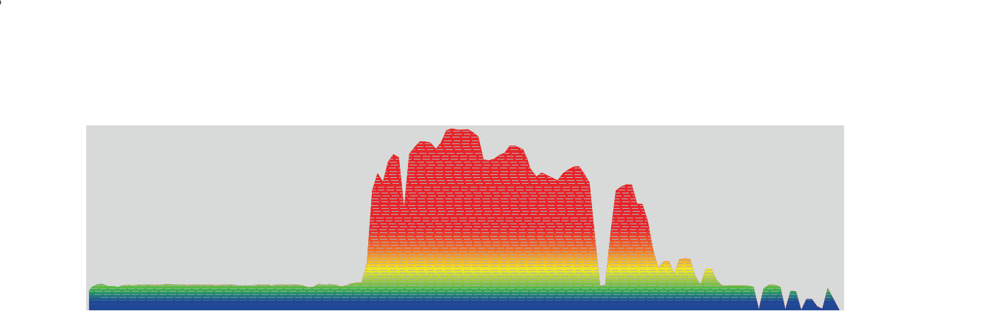

### About
I am a postdoctoral researcher studying repetitive DNA genomics in the Larracuente Lab at the University of Rochester. I recieved my PhD in Integrative Biology from Oregon State University in 2018 under the mentorship of David Maddison. My PhD work focused on the species delimitation, taxonomy, and repetitive DNA dynamics in ground beetles (Carabidae) in the _breve_ species group of _Bembidion_.  an. . Prior to my PhD I completed a Master's degree in Biology at Brigham Young University under the mentorship of Dennis Shiozawa.

This is a normal paragraph following a header. GitHub is a code hosting platform for version control and collaboration. It lets you and others work together on projects from anywhere.

## Evolutionary Biology Research

### Repetitive DNA

Large fractions of the DNA in most organisms are made up of repetitive DNA sequences... 

My research focuses on comparative genomics of repetitive DNA. Repeats have been understudied for decades due to technical and computational challenges associated with their sequencing and assembly. As recent advances in sequencing technology overcome those obstacles, work in model organisms is shedding new light on the critical role of repeats in genome evolution at various scales. However, we know little about how repeat dynamics shape genome evolution in naturally evolving species across changing ecological landscapes. My research program integrates field work, data generation, and development of new computational workflows to investigate comparative repeat genomics across phylogenetic scales in insects, with an emphasis on ground beetles. Studying repeats in a comparative evolutionary framework that spans populations, species, and diverse clades is a powerful lens for understanding patterns, processes, and mechanisms that underlie genome evolution, repeat biology, and the diversification of life. My research forms a bridge between the biodiversity community and the comparative genomics community. My long-term interests include investigating links between ecological factors (e.g., environmental stress), rapid evolution of repetitive elements, and the process of speciation. I combine my research background in biodiversity (see below) with my training on repetitive DNA genomics to extend repetitive DNA genomics to natural populations of biodiverse groups, and investigate how repeats shape the evolution of genomes and species.
